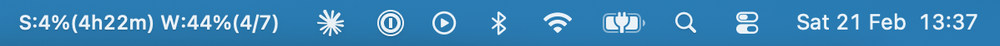
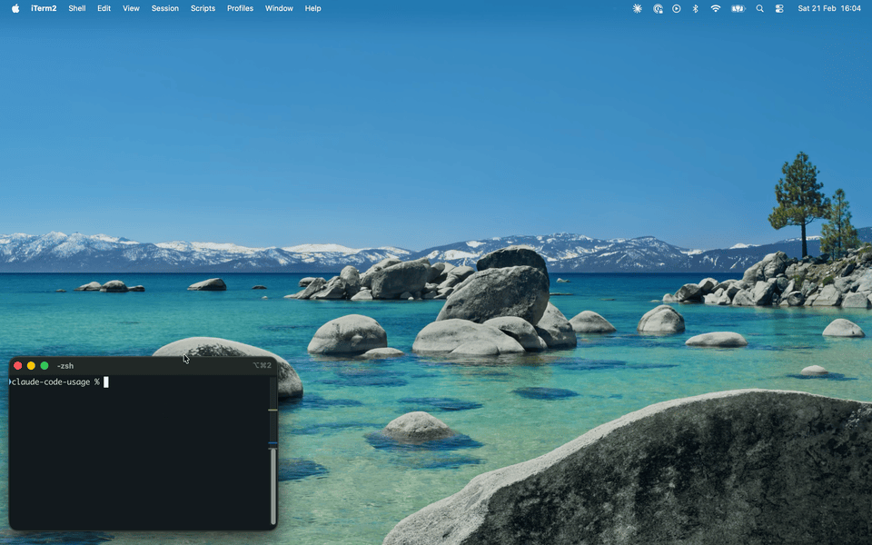

# Claude Code Usage Widget

A macOS menu bar widget that monitors your [Claude Code](https://claude.ai/code) usage in real time. Displays session and weekly quota percentages with countdown timers in a floating always-on-top panel.

<!--  -->

## ✨ Features

- 📊 **Session & weekly usage monitoring** — polls Claude Code's `/usage` command automatically with manual refresh
- 🎨 **Pace-based color coding** — weekly usage color reflects whether you're ahead or behind expected pace in the billing cycle
- ⏱️ **Countdown timers** — live countdowns to session and weekly quota resets, with full reset datetime display
- 📏 **Progress bars** — visual progress bars for both session and weekly usage
- 🪟 **Floating panel** — always-on-top window with pin/unpin toggle and persistent position
- 🔍 **Zoom controls** — scale the widget from 1.0x to 2.0x
- ⚙️ **Custom status bar formats** — configurable menu bar display with 8 format variables
- 🌗 **Dark mode toggle** — switch between light and dark appearance
- ⌨️ **Global shortcut** — toggle widget visibility with `Cmd+Shift+U`
- 🖥️ **Menu bar integration** — quick access via macOS status bar with quit menu
- 🕐 **Last updated timestamp** — optional "Updated X seconds ago" display

<div>
  
  
  
</div>

## 📋 Requirements

- macOS 14.0+
- [tmux](https://github.com/tmux/tmux) installed and on your `PATH`
- [Claude Code CLI](https://claude.ai/code) installed and authenticated
- An Anthropic account on a **Pro**, **Max**, **Team**, or **Enterprise** plan

### Installing tmux

```bash
# Homebrew
brew install tmux
```

For other installation methods, see the [tmux wiki](https://github.com/tmux/tmux/wiki/Installing).

## 🚀 Getting Started

1. Clone the repository:
   ```bash
   git clone https://github.com/anthropics/claude-code-usage.git
   cd claude-code-usage
   ```
2. Build the project:
   ```bash
   make build
   ```
3. Run the widget:
   ```bash
   make run
   ```

## 💡 How It Works

The widget uses an **MVVM architecture** with **Swift 6 structured concurrency**:

1. **TmuxManager** (actor) creates an isolated tmux session and sends `/usage` keystrokes to Claude Code CLI
2. **UsageParser** extracts usage percentages and reset times from the captured output via regex
3. **UsageViewModel** publishes state changes on a 10-second polling interval
4. **SwiftUI views** react to state updates and render the floating panel

Color coding uses fixed thresholds for session usage (green < 50%, orange 50–79%, red 80%+) and **pace-based logic** for weekly usage that compares actual usage against expected usage for the current day in the billing cycle.

### Weekly Pace-Based Color Coding

The weekly quota resets every 7 days. If you spread usage evenly, the ideal pace looks like this:

| Day | Daily % | Cumulative % |
|-----|---------|--------------|
| 1   | 14.29%  | 14.29%       |
| 2   | 14.29%  | 28.57%       |
| 3   | 14.29%  | 42.86%       |
| 4   | 14.29%  | 57.14%       |
| 5   | 14.29%  | 71.43%       |
| 6   | 14.29%  | 85.71%       |
| 7   | 14.29%  | 100%         |

This matters because raw percentage alone doesn't tell you if you're on track. Using 50% of your quota sounds high — but if you're on day 4, you're actually *under* pace (expected: 57.14%). Conversely, hitting 50% on day 2 means you're burning through quota almost twice as fast as sustainable.

The widget uses this to color the weekly usage indicator:
- **Green** — you're at or below the expected pace for the current day
- **Orange/Red** — you're ahead of pace and risk running out before the weekly reset

## ⚙️ Custom Status Bar Formats

The menu bar display is configurable via the options panel. Choose a preset style or define a custom format using these variables:

| Variable | Description | Example |
|----------|-------------|---------|
| `{s}` | Session usage % | `42%` |
| `{w}` | Weekly usage % | `65%` |
| `{sr}` | Session reset countdown | `2h 15m` |
| `{wr}` | Weekly reset countdown | `3d 12h` |
| `{wd}` | Days elapsed in billing cycle | `4` |
| `{wl}` | Days left in billing cycle | `3` |
| `{srt}` | Session reset datetime | `Feb 21, 2:00pm` |
| `{wrt}` | Weekly reset datetime | `Feb 24, 12:00am` |

Example custom format: `S:{s} W:{w} ({wl}d left)`

## 🛠️ Build Commands

| Command       | Description                |
|--------------|----------------------------|
| `make build`  | Compile the project        |
| `make run`    | Build and run the widget   |
| `make test`   | Run unit tests             |
| `make clean`  | Remove build artifacts     |
| `make reset`  | Reset saved preferences    |

## 🤝 Contributing

Contributions are welcome! Feel free to open issues and pull requests on [GitHub](https://github.com/anthropics/claude-code-usage).

## 📄 License

[MIT](LICENSE)
